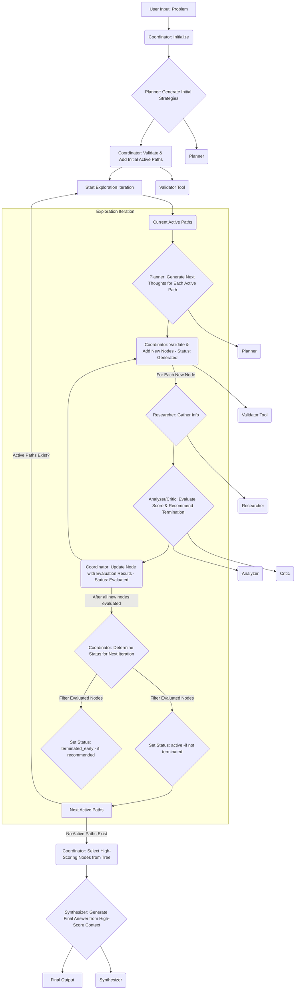

# mas-tree-of-thought

This project implements a multi-agent system coordinated by a root agent (`ToT_Coordinator`). The coordinator manages a Tree of Thoughts (ToT) using an LLM-driven evaluation process to explore potential solutions for complex problems.

## Core Concepts

*   **Tree of Thoughts (ToT) with LLM-Driven Exploration:** Problems are explored by building a tree where each node represents a thought or intermediate step. The exploration is guided dynamically by evaluating the promise of each thought using specialist LLM agents, rather than a fixed beam width or depth.
*   **Coordinator Agent (`ToT_Coordinator`):** Orchestrates the ToT workflow. It initializes the tree, manages the set of active thoughts, delegates generation and evaluation tasks to specialist agents, determines which paths to continue exploring based on evaluation (including termination recommendations), and synthesizes the final result from the most promising thoughts discovered.
*   **Specialist Agents:** A team of agents (Planner, Researcher, Analyzer, Critic, Synthesizer) each handle specific types of sub-tasks delegated by the coordinator (e.g., generating next steps, evaluating thoughts, gathering information, synthesizing results).
*   **Thought Validator Tool (`validate_thought_node_data`):** A function tool used by the Coordinator to ensure the structural integrity and required metadata of each thought node before adding it to the tree.
*   **Dynamic Generation & Evaluation:** The number of thoughts generated can be dynamic. The evaluation process incorporates factors like research findings, analysis, critique, and crucially, a recommendation on whether to continue exploring a path.
*   **Multi-Node Synthesis:** The final result is synthesized not just from a single best path, but by considering multiple high-scoring thought nodes identified during the exploration, potentially originating from different branches or depths of the tree.

## Workflow

The `ToT_Coordinator` manages the following phases:

1.  **Initialization:**
    *   Receives the initial problem from the user.
    *   Creates the root node of the thought tree.
    *   Calls the `Planner` agent to generate an initial set of distinct strategies (initial active paths).
    *   Validates and adds these initial strategy nodes to the tree.
2.  **Exploration Loop (Continues as long as active paths exist):**
    *   **Generation:** For each active node, calls the `Planner` agent to generate potential next thoughts (steps, sub-topics, questions). The number generated can be dynamic. Validates and adds new nodes with status 'generated'.
    *   **Evaluation:** For each newly generated node:
        *   Calls the `Researcher` agent to gather relevant information.
        *   Calls the `Analyzer` and `Critic` agents to evaluate the thought's soundness and promise, considering the research findings. Scores and a **termination recommendation** (True/False) are extracted.
        *   Updates the node with scores, research findings, evaluation details, and the termination recommendation. Status becomes 'evaluated'.
    *   **Selection / Status Update:** Reviews all 'evaluated' nodes.
        *   Nodes *not* recommended for termination have their status set to 'active' and form the pool for the next generation step.
        *   Nodes recommended for termination have their status set to 'terminated_early'.
        *   The loop terminates if no nodes become 'active'.
3.  **Synthesis:**
    *   Identifies multiple high-scoring nodes from the entire tree (evaluated, active, or terminated_early) based on a score threshold (or top-N fallback if none meet the threshold).
    *   Constructs a context including the initial problem and the identified high-scoring thoughts.
    *   Calls the `Synthesizer` agent, providing this multi-node context, to generate the final answer.

## Setup and Usage

(Instructions on how to set up and run the agent would go here, including required environment variables.)

**Required Environment Variables:**

*   **LLM Configuration:**
    *   `PLANNER_MODEL_CONFIG`, `RESEARCHER_MODEL_CONFIG`, `ANALYZER_MODEL_CONFIG`, `CRITIC_MODEL_CONFIG`, `SYNTHESIZER_MODEL_CONFIG`, `COORDINATOR_MODEL_CONFIG`: Specify the model for each agent (e.g., `google:gemini-2.0-flash`, `openrouter:google/gemini-2.5-pro`, `openai:gpt-4o`). See `_configure_llm_models` in `agent.py` for details.
*   **API Keys/Credentials:**
    *   `GOOGLE_API_KEY`: Needed if using Google AI Studio models.
    *   `GOOGLE_GENAI_USE_VERTEXAI=true`: Set this along with `GOOGLE_CLOUD_PROJECT` and `GOOGLE_CLOUD_LOCATION` if using Vertex AI.
    *   `OPENROUTER_API_KEY`: Needed if using OpenRouter models.
    *   `OPENAI_API_KEY` and `OPENAI_API_BASE`: Needed if using OpenAI or compatible models via LiteLLM.
*   **Optional Rate Limiting (for Google AI Studio Free Tier):**
    *   `USE_FREE_TIER_RATE_LIMITING=true`: Set to enable delays between calls.
    *   `FREE_TIER_SLEEP_SECONDS=2.0`: Adjust the delay duration (default is 2 seconds).

(Add specific commands for running the agent, e.g., using a CLI tool or integrating it into another application.)
