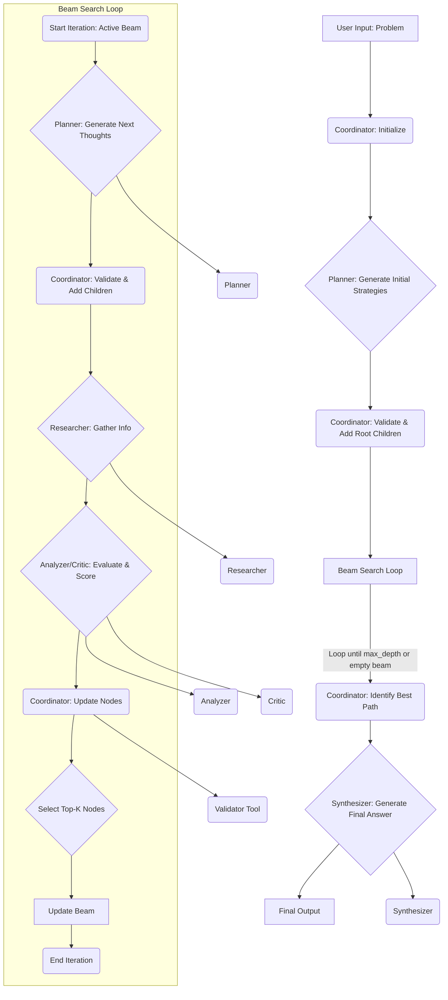

# mas-tree-of-thought

This project implements a multi-agent system coordinated by a root agent (`ToT_Coordinator`). The coordinator manages a Tree of Thoughts (ToT) using Beam Search to explore potential solutions for complex problems.

## Core Concepts

*   **Tree of Thoughts (ToT) with Beam Search:** Problems are explored by building a tree where each node represents a thought or intermediate step. Beam search is used to efficiently explore the most promising branches of the tree.
*   **Coordinator Agent (`ToT_Coordinator`):** Orchestrates the ToT workflow. It initializes the tree, manages the beam of active thoughts, delegates generation and evaluation tasks to specialist agents, selects the best thoughts at each step, and synthesizes the final result.
*   **Specialist Agents:** A team of agents (Planner, Researcher, Analyzer, Critic, Synthesizer) each handle specific types of sub-tasks delegated by the coordinator (e.g., generating next steps, evaluating thoughts, gathering information).
*   **Thought Validator Tool (`validate_thought_node_data`):** A function tool used by the Coordinator to ensure the structural integrity and required metadata of each thought node before adding it to the tree.
*   **Dynamic Generation & Evaluation:** The number of thoughts generated and the evaluation process incorporate factors like node score and depth to adapt the search strategy. Research is integrated into the evaluation.

## Workflow

The `ToT_Coordinator` manages the following phases:

1.  **Initialization:**
    *   Receives the initial problem from the user.
    *   Creates the root node of the thought tree.
    *   Calls the `Planner` agent to generate an initial set of distinct strategies (initial beam).
    *   Validates and adds these initial strategy nodes to the tree.
2.  **Beam Search Loop (Repeated up to `max_depth`):**
    *   **Generation:** For each active node in the current beam, calls the `Planner` agent to generate potential next thoughts (steps, sub-topics, questions). The number generated can be dynamic. Validates and adds new nodes.
    *   **Evaluation:** For each newly generated node:
        *   Calls the `Researcher` agent to gather relevant information.
        *   Calls the `Analyzer` and `Critic` agents to evaluate the thought's soundness and promise, considering the research findings. Scores are extracted.
        *   Updates the node with scores, research findings, and evaluation details.
    *   **Selection:** Selects the top-k (`beam_width`) evaluated nodes based on their scores to form the beam for the next iteration. Marks selected nodes as 'active' and others as 'pruned'.
3.  **Synthesis:**
    *   Identifies the best path through the tree based on the highest-scoring node found.
    *   Traces the path from the best node back to the root.
    *   Calls the `Synthesizer` agent, providing the initial problem and the best thought path, to generate the final answer.

## Setup and Usage

(Instructions on how to set up and run the agent would go here, including required environment variables like `OPENROUTER_API_KEY`, `GOOGLE_API_KEY` or Vertex AI setup, `BEAM_WIDTH`, `MAX_DEPTH`.)
