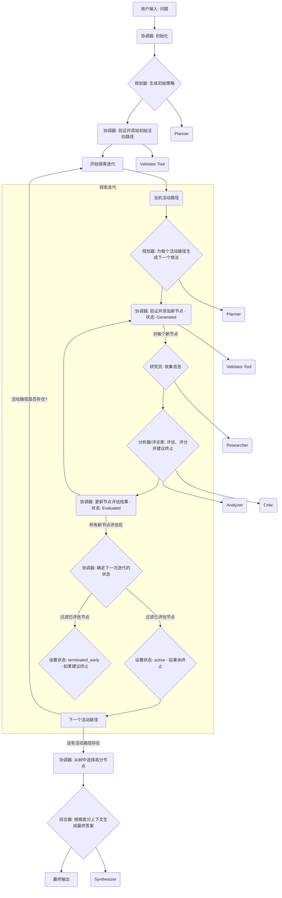

# mas-tree-of-thought 

[](https://twitter.com/FradSer) [](https://www.python.org/downloads/) [](https://google.github.io/adk-docs/) 

[English](README.md) | 简体中文

本项目实现了一个由根代理（`ToT_Coordinator`）协调的多代理系统。协调器使用LLM驱动的评估过程管理思维树（ToT），以探索复杂问题的潜在解决方案。

## 核心概念

*   **带LLM驱动探索的思维树 (ToT):** 通过构建一棵树来探索问题，其中每个节点代表一个想法或中间步骤。探索过程由专家LLM代理动态评估每个想法的前景来指导，而不是固定的束宽或深度。
*   **协调器代理 (`ToT_Coordinator`):** 策划ToT工作流。它初始化树，管理活动想法的集合，将生成和评估任务委托给专家代理，根据评估（包括终止建议）确定要继续探索的路径，并从发现的最有希望的想法中综合最终结果。它被实现为一个 ADK [自定义代理 (Custom Agent)](https://google.github.io/adk-docs/agents/custom-agents/)，以管理 ToT 流程中复杂的条件逻辑。
*   **专家代理:** 一个代理团队（规划器、研究员、分析器、评论家、综合器），每个代理处理协调器委托的特定类型的子任务（例如，生成下一步、评估想法、收集信息、综合结果）。
    *   `Researcher` 代理明确使用了 ADK 内置的 `google_search` 工具。
*   **想法验证器工具 (`validator_tool`):** 一个包装了 `validate_thought_node_data` 函数的 `FunctionTool` 实例。协调器使用它在将每个想法节点添加到树之前确保其结构完整性和所需的元数据。
*   **动态生成与评估:** 生成的想法数量可以是动态的。评估过程包含研究发现、分析、批判等因素，以及至关重要的关于是否继续探索某条路径的建议。
*   **多节点综合:** 最终结果不仅仅是根据单一最佳路径综合而成，而是考虑探索过程中识别出的多个高分想法节点，这些节点可能来自树的不同分支或深度。

## 工作流

`ToT_Coordinator` 管理以下阶段：

1.  **初始化:**
    *   从用户接收初始问题。
    *   创建思维树的根节点。
    *   调用 `Planner` 代理生成一组初始的不同策略（初始活动路径）。
    *   验证并将这些初始策略节点添加到树中。
2.  **探索循环 (只要存在活动路径就继续):**
    *   **生成:** 对于每个活动节点，调用 `Planner` 代理生成潜在的下一个想法（步骤、子主题、问题）。生成的数量可以是动态的。验证并添加状态为 'generated' 的新节点。
    *   **评估:** 对于每个新生成的节点：
        *   调用 `Researcher` 代理（配备 `google_search` 工具）收集相关信息。
        *   调用 `Analyzer` 和 `Critic` 代理评估想法的合理性和前景，并考虑研究结果。提取分数和**终止建议** (True/False)。
        *   使用分数、研究结果、评估细节和终止建议更新节点。状态变为 'evaluated'。
    *   **选择/状态更新:** 审查所有 'evaluated' 状态的节点。
        *   *不*建议终止的节点状态设置为 'active'，并构成下一步生成的池。
        *   建议终止的节点状态设置为 'terminated_early'。
        *   如果没有节点变为 'active'，循环终止。
3.  **综合:**
    *   根据分数阈值（如果无节点满足阈值，则回退到前N个）从整个树（evaluated、active 或 terminated_early）中识别多个高分节点。
    *   构建一个包含初始问题和已识别高分想法的上下文。
    *   调用 `Synthesizer` 代理，提供此多节点上下文，以生成最终答案。



> **警告：高 Token 消耗**
> 本项目在思维树流程的每一步（生成、研究、分析、批判）都涉及多次 LLM 调用。运行复杂问题可能会消耗大量 Token。请密切关注您的使用量和相关成本。

## 安装与使用

1.  **克隆仓库:**
    ```bash
    git clone https://github.com/FradSer/mas-tree-of-thought
    cd mas-tree-of-thought
    ```
2.  **设置环境变量:**
    *   进入 `multi_tool_agent` 目录: `cd multi_tool_agent`
    *   复制环境变量示例文件: `cp .env.example .env`
    *   编辑 `.env` 文件，填入你实际的 API 密钥、模型配置和云项目详情（如果适用）。请遵循文件中的注释说明。
3.  **使用 uv 安装依赖:**
    ```bash
    uv sync
    ```
4.  **运行项目:**
    ```bash
    adk web
    ```

**所需环境变量 (在 `multi_tool_agent/.env` 文件中定义):**

*   **LLM 配置:**
    *   `PLANNER_MODEL_CONFIG`, `RESEARCHER_MODEL_CONFIG`, `ANALYZER_MODEL_CONFIG`, `CRITIC_MODEL_CONFIG`, `SYNTHESIZER_MODEL_CONFIG`, `COORDINATOR_MODEL_CONFIG`: 为每个代理指定模型（例如，`google:gemini-2.0-flash`, `openrouter:google/gemini-2.5-pro`, `openai:gpt-4o`）。详见 `agent.py` 中的 `_configure_llm_models`。
*   **API 密钥/凭证:**
    *   `GOOGLE_API_KEY`: 如果使用 Google AI Studio 模型，则需要。
    *   `GOOGLE_GENAI_USE_VERTEXAI=true`: 如果使用 Vertex AI，则设置此项以及 `GOOGLE_CLOUD_PROJECT` 和 `GOOGLE_CLOUD_LOCATION`。
    *   `OPENROUTER_API_KEY`: 如果使用 OpenRouter 模型，则需要。
    *   `OPENAI_API_KEY` 和 `OPENAI_API_BASE`: 如果通过 LiteLLM 使用 OpenAI 或兼容模型，则需要。
*   **可选的速率限制 (针对 Google AI Studio 免费套餐):**
    *   `USE_FREE_TIER_RATE_LIMITING=true`: 设置为启用调用之间的延迟。
    *   `FREE_TIER_SLEEP_SECONDS=2.0`: 调整延迟时间（默认为 2 秒）。